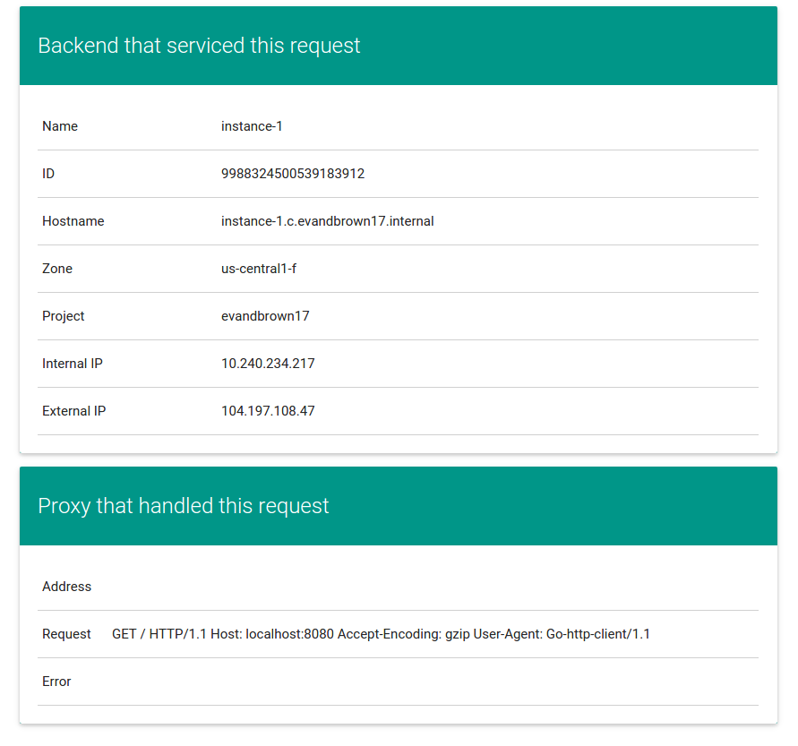

Deployments
===========

Module objectives
-----------------

- Learn sample application architecture
- Deploy sample application to Kubernetes

---

Theory
------

- Declarative updates for Pods and ReplicaSets
- Changes actual state to desired state
- ReplicaSet rollout
- Rollback Deployment revision
- Scale the Deployment to facilitate additional load

More information: https://kubernetes.io/docs/concepts/workloads/controllers/deployment/

Updating Deployments

Deployments with a matching selector value will rollover existing deployments in progress

By default no more then 25% of pods will be unavailable druning the deployment under desired amount. 25% Pods surge over the desired amount. Certainly deployment should have enough pods to satisfy these criteria.

Deployment keeps a revision history and can roll back to any previous version at any time.

---

The sample app
--------------

You'll use a very simple sample application—`gceme`—as the basis for your CD pipeline. `gceme` is written in Go and is located in the `sample-app` directory in this repo. When you run the `gceme` binary on a GCE instance, it displays the instance's metadata in a card:



The binary supports two modes of operation, designed to mimic a microservice. In backend mode, `gceme` will listen on a port (8080 by default) and return GCE instance metadata as JSON, with content-type=application/json. In frontend mode, `gceme` will query a backend `gceme` service and render that JSON in the UI you saw above. It looks roughly like this:

```
-----------      ------------      ~~~~~~~~~~~~        -----------
|         |      |          |      |          |        |         |
|  user   | ---> |   gceme  | ---> | lb/proxy | -----> |  gceme  |
|(browser)|      |(frontend)|      |(optional)|   |    |(backend)|
|         |      |          |      |          |   |    |         |
-----------      ------------      ~~~~~~~~~~~~   |    -----------
                                                  |    -----------
                                                  |    |         |
                                                  |--> |  gceme  |
                                                       |(backend)|
                                                       |         |
                                                       -----------
```

Both the frontend and backend modes of the application support two additional URLs:

1. `/version` prints the version of the binary (declared as a const in `main.go`)
1. `/healthz` reports the health of the application. In frontend mode, health will be OK if the backend is reachable.

A deployment is a supervisor for pods and replica sets, giving you fine-grained control over how and when a new pod version is rolled out as well as rolled back to a previous state.

Deploy the sample app to Kubernetes
-----------------------------------

In this section, you will deploy the mysql database, `gceme` frontend and backend to Kubernetes using Kubernetes manifest files (included in this repo) that describe the environment that the `gceme` binary/Docker image will be deployed to. They use a default `gceme` Docker image that you will be updating with your own in a later section.

You'll have two primary environments—[canary](http://martinfowler.com/bliki/CanaryRelease.html) and production. Use Kubernetes to manage them.

> **Note**: The manifest files for this section of the tutorial are in `sample-app/k8s`. You are encouraged to open and read each one before creating it per the instructions.

1. First change directories to the sample-app:

  ```shell
  $ cd sample-app
  ```

1. Create secret with MySQL administrator password

    ```
    $ kubectl create secret generic mysql --from-literal=password=root
    secret/mysql created
    ```

1. Create manifest to deploy MySQL database

    ```
    apiVersion: extensions/v1beta1
    kind: Deployment
    metadata:
    name: mysql
    labels:
        app: mysql
        role: db
    spec:
    replicas: 1
    selector:
        matchLabels:
        app: mysql
    template:
        metadata:
        labels:
            app: mysql
        spec:
        containers:
            - image: mysql:5.6
            name: mysql
            env:
                - name: MYSQL_ROOT_PASSWORD
                valueFrom:
                    secretKeyRef:
                    name: mysql
                    key: password
            ports:
                - containerPort: 3306
                name: mysql
    ```

    Save it as `k8s/training/db.yaml`.

1. Deploy MySQL to Kubernetes

    ```
    $ kubectl apply -f k8s/training/db.yaml
    ```

1. Create the canary and production Deployments

    ```shell
    $ kubectl apply -f k8s/production/backend-production.yaml
    $ kubectl apply -f k8s/production/frontend-production.yaml
    $ kubectl apply -f k8s/canary
    ```

1. Scale the production deployment:

    ```shell
    $ kubectl scale deployment gceme-frontend-production --replicas=4
    ```

1. Check deployment, replica set and pods, created by the previous command.

    ```
    $ kubectl get deploy
    $ kubectl get rs
    $ kubectl get pods
    ```

Exercises
---------

1. Optional: Investigate source code of the sample

    Look at manifests in `k8s/production` and `k8s/canary` folders
