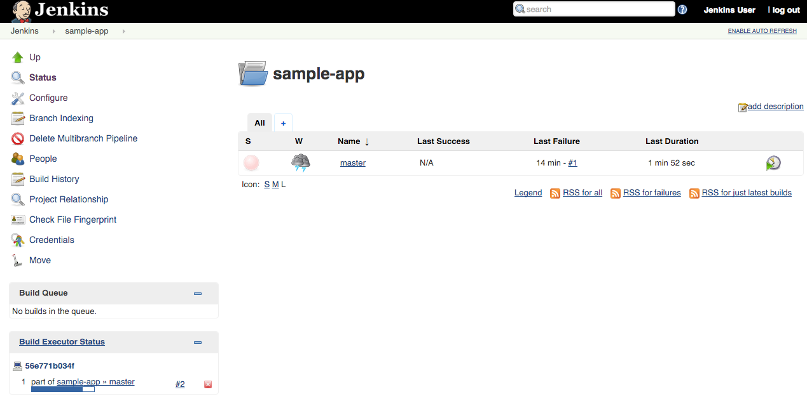
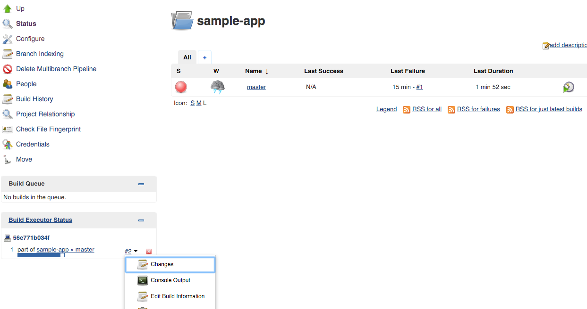

Canary deployment
-----------------

Create a branch for the canary environment called `canary`
   
   ```shell
    $ git checkout -b canary
   ```

The [`Jenkinsfile`](https://jenkins.io/doc/book/pipeline/jenkinsfile/) is written using the Jenkins Workflow DSL (Groovy-based). It allows an entire build pipeline to be expressed in a single script that lives alongside your source code and supports powerful features like parallelization, stages, and user input.

Now that your pipeline is working, it's time to make a change to the `gceme` app and let your pipeline test, package, and deploy it.

The canary environment is rolled out as a percentage of the pods behind the production load balancer.
In this case we have 1 out of 5 of our frontends running the canary code and the other 4 running the production code. This allows you to ensure that the canary code is not negatively affecting users before rolling out to your full fleet.

You can use the [labels](http://kubernetes.io/docs/user-guide/labels/) `env: production` and `env: canary` in Google Cloud Monitoring in order to monitor the performance of each version individually.

1. In the `sample-app` repository in Cloud Shell Editor open `templates/base.html` and replace the word `blue` with `orange` (there should be exactly 4 occurrences):

  ```html
  //snip
  <div class="card orange">
  <div class="card-content white-text">
  <div class="card-title">Backend that serviced this request</div>
  //snip
  ```

1. In the same repository, open `main.go` and change the version number from `1.0.0` to `2.0.0`:

   ```go
   //snip
   const version string = "2.0.0"
   //snip
   ```

1. Add canary deployment stage

  ```
  stage('Deploy Canary') {
      // Production branch
      when { branch 'canary' }
      steps{
        container('kubectl') {
        // Change deployed image in canary to the one we just built
          sh("sed -i.bak 's#REPLACE_WITH_IMAGE#${imageTag}#' ./k8s/production/*.yaml")
          sh("kubectl --namespace=production apply -f k8s/services/")
          sh("kubectl --namespace=production apply -f k8s/canary/")
          sh("echo http://`kubectl --namespace=production get service/${feSvcName} -o jsonpath='{.status.loadBalancer.ingress[0].ip}'` > ${feSvcName}")
        }
      }
  }
  ```

1. `git add templates/base.html main.go`, then `git commit -m "Version 2"`, and finally `git push origin canary` your change.

1. When your change has been pushed to the Git repository, navigate to your Jenkins job. Click the "Scan Multibranch Pipeline Now" button.

  

1. Once the build is running, click the down arrow next to the build in the left column and choose **Console Output**:

  

1. Track the output for a few minutes and watch for the `kubectl --namespace=production apply...` to begin. When it starts, start new terminal that's polling canary's `/version` URL and observe it start to change in some of the requests:

   ```
   $ export FRONTEND_SERVICE_IP=$(kubectl get -o jsonpath="{.status.loadBalancer.ingress[0].ip}"  --namespace=production services gceme-frontend)
   $ while true; do curl http://$FRONTEND_SERVICE_IP/version; sleep 1;  done
   1.0.0
   1.0.0
   1.0.0
   1.0.0
   2.0.0
   2.0.0
   1.0.0
   1.0.0
   1.0.0
   1.0.0
   ```

   You have now rolled out that change to a subset of users.

1. Once the change is deployed to canary, you can continue to roll it out to the rest of your users by creating a branch called `production` and pushing it to the Git server:

   ```shell
    $ git checkout master
    $ git merge canary
    $ git push origin master
   ```
1. In a minute or so you should see that the master job in the sample-app folder has kicked off:

    

1. Clicking on the `master` link will show you the stages of your pipeline as well as pass/fail and timing characteristics.

    

1. Open the terminal that's polling canary's `/version` URL and observe that the new version (2.0.0) has been rolled out and is serving all requests.

   ```
   2.0.0
   2.0.0
   2.0.0
   2.0.0
   2.0.0
   2.0.0
   2.0.0
   2.0.0
   2.0.0
   2.0.0
   ```

1. Look at the `Jenkinsfile` in the project to see how the workflow is written.
